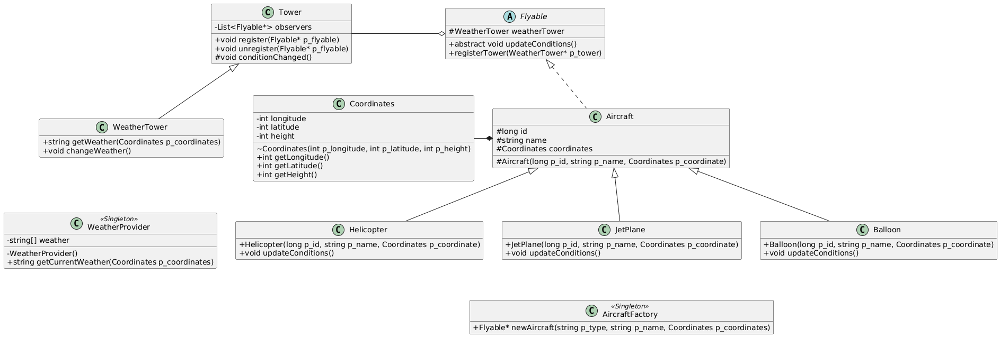

# 42 avaj-launcher

Aircraft simulation system modeling flight through dynamic weather.
Implements Observer, Factory, and Singleton patterns.

## Class Diagram



### Legend

- **Symbols**:
    - **(C)**: Standard Class.
    - **(A)**: Abstract Class or Interface (name is *italicized*).
    - **Singleton**: Indicates the class follows the Singleton pattern.
- **Class Structure**: Each box is divided into three sections:
    - **Top**: Class name.
    - **Middle**: Attributes (variables/fields).
    - **Bottom**: Operations (methods).
- **Visibility**:
    - `+` : Public
    - `-` : Private
    - `#` : Protected
    - `~` : Package-private
- **Arrows and Lines**:
    - **Generalization (Inheritance)**: A solid line with a hollow triangle arrow (e.g., `JetPlane` inherits from `Aircraft`).
    - **Realization (Implementation)**: A dashed line with a hollow triangle arrow (e.g., `Aircraft` implements `Flyable`).
    - **Aggregation**: A solid line with a hollow diamond (e.g., `Tower` contains a list of `Flyable` objects).
    - **Composition**: A solid line with a filled diamond (e.g., `Aircraft` uniquely owns its `Coordinates`).

## Design Patterns

- **Observer**: `Tower` maintains a list of `Flyable` objects and notifies them of weather changes. This decouples the tower from the specific types of aircraft, allowing new types to be added without modifying the tower logic.
- **Factory**: `AircraftFactory` centralizes the creation of aircraft objects from scenario strings. This hides the complexity of instantiation and ensures that coordinates (like height limits) are handled consistently during creation.
- **Singleton**: `WeatherProvider`, `AircraftFactory`, and `Logger` use this pattern to ensure a single point of access to shared resources.
    - **WeatherProvider**: Ensures all aircraft receive consistent weather data from a single source.
    - **AircraftFactory**: Provides a global access point for creating aircraft without needing to pass factory instances around.
    - **Logger**: Prevents resource conflicts by ensuring only one file handle is open for `simulation.txt`, allowing multiple aircraft to log their status safely.

## Features

- **Dynamic Weather**: SUN, RAIN, FOG, SNOW affecting coordinates and height.
- **Aircraft Types**:
    - **JetPlane**: Focus on latitude.
    - **Helicopter**: Focus on longitude.
    - **Balloon**: Focus on altitude.
- **Observer Pattern**: `WeatherTower` manages and notifies aircraft.
- **Singleton Pattern**: `WeatherProvider` and `AircraftFactory`.
- **Validation**: Strict scenario parsing with `ParsingException`.

## Installation & Compilation

Requirements: Java (LTS).

```bash
make
make clean
```

## Usage

Default scenario (`test/scenario.txt`):
```bash
make run
```

Custom scenario:
```bash
make run SCENARIO=path/to/scenario.txt
# OR
java -cp src fr._42lyon.avaj.simulator.Simulator path/to/scenario.txt
```

Output: `simulation.txt`.

## Scenario File Format

```text
[NUMBER_OF_SIMULATIONS]
[TYPE] [NAME] [LONGITUDE] [LATITUDE] [HEIGHT]
```

**Example:**
```text
25
Balloon B1 2 3 20
JetPlane J1 23 44 32
Helicopter H1 654 33 20
```

## Weather Effects

| Weather | JetPlane | Helicopter | Balloon |
| :--- | :--- | :--- | :--- |
| **SUN** | Latitude +10, Height +2 | Longitude +10, Height +2 | Longitude +2, Height +4 |
| **RAIN** | Latitude +5 | Longitude +5 | Height -5 |
| **FOG** | Latitude +1 | Longitude +1 | Height -3 |
| **SNOW** | Height -7 | Height -12 | Height -15 |

### Rules
- **Coordinates**: Positive integers.
- **Height**: Clamped to **0-100**.
- **Landing**: At height **0**, aircraft lands and unregisters.

## Architecture

- `Flyable` (Abstract Class): Base behavior for flying objects.
- `Aircraft`: Base class for aircraft types.
- `WeatherTower`: Extends `Tower`, coordinates weather updates.
- `WeatherProvider`: Generates weather from coordinates.
- `AircraftFactory`: Instantiates aircraft.

## Validation

The simulator validates:
- Simulation count (first line, positive integer).
- Aircraft type and data format.
- Coordinate and height ranges.
